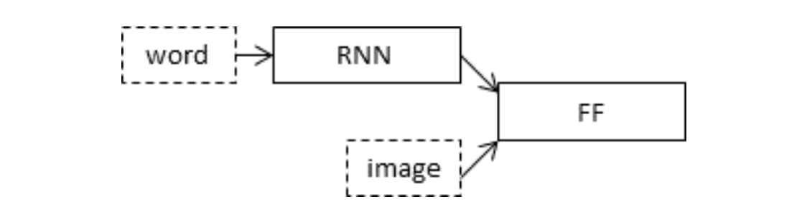
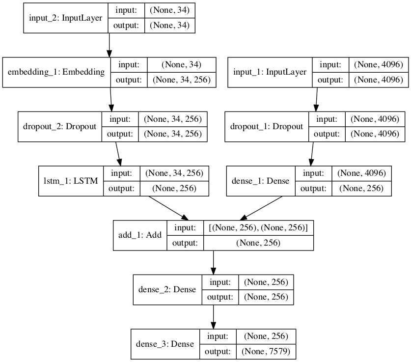

# Automated Image Captioning
This project focuses on building an AI in which when an image is passed and a caption is generated automatically.
## Overview
This model is divided into 5 parts :-
* Dataset
* Preparation of Text Data
* Preparation of Image Dataset
* Building the model 
* Generating the caption
* Inspiration

## Dataset 
The dataset used is Flickr8K dataset which can be downloaded directly from kaggle using the code
```python
!pip install kaggle
!mkdir .kaggle
 
import json
#In username enter your username obtained from kaggle and key obtained
token = {"username":"ENTER YOUR USERNAME","key":"ENTER YOUR KEY"}
with open('/content/.kaggle/kaggle.json', 'w') as file:
    json.dump(token, file)
    
!cp /content/.kaggle/kaggle.json ~/.kaggle/kaggle.json
!kaggle config set -n path -v{/content}
!chmod 600 /root/.kaggle/kaggle.json
!kaggle datasets download -d lakshmi25npathi/imdb-dataset-of-50k-movie-reviews    

!unzip {/content}/datasets/lakshmi25npathi/imdb-dataset-of-50k-movie-reviews/imdb-dataset-of-50k-movie-reviews.zip
```
You can also download the dataset from the [link](https://www.kaggle.com/shadabhussain/flickr8k/download) manually. For more to know about downloading the dataset directly from Kaggle you can refer to this [article](https://towardsdatascience.com/setting-up-kaggle-in-google-colab-ebb281b61463)

## Preparation of Text Data
![""] 

## Building the model
Both the models are merged as shown in the diagram below 




## Inspiration
I took the inspiration from the articles such as [Automated Caption Generator](https://machinelearningmastery.com/develop-a-deep-learning-caption-generation-model-in-python/, 'Machine Leanirning Mastery') 
